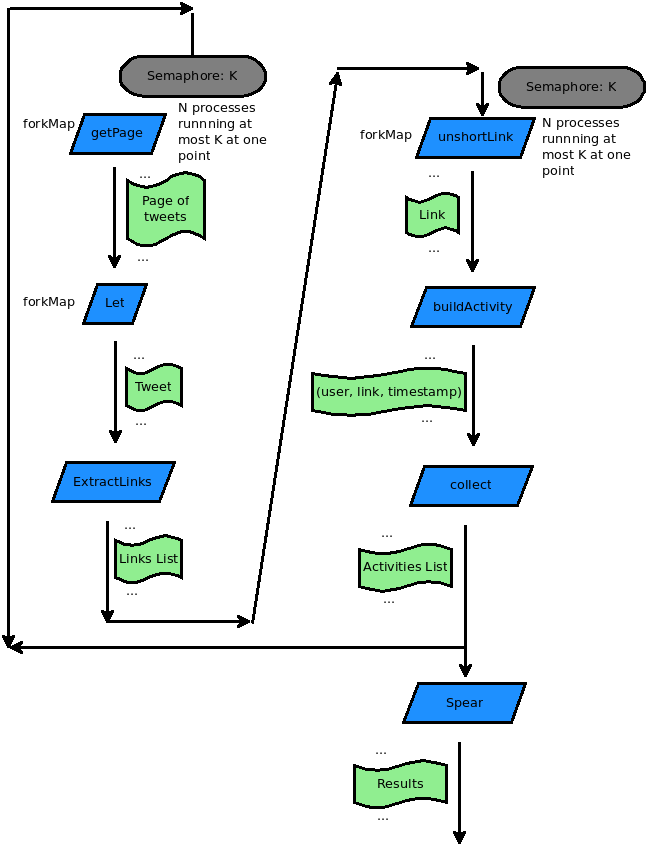

### About
This program discovers experienced users and quality links in a twitter stream based on a topic. It uses the [SPEAR](http://eprints.soton.ac.uk/273196/1/auyeung_noll_coin_spear_2009-07-17.pdf) algorithm, a variation of PageRank in which we have 2 types of nodes: users and documents, and users link to documents. It is meant for educational purposes.

### Prerequisites
The implementation is in [Scala](http://www.scala-lang.org/) and the orchestration is done in [Orc](http://orc.csres.utexas.edu/). We use [Parallel](https://sites.google.com/site/piotrwendykier/software/parallelcolt) [Colt](http://acs.lbl.gov/software/colt/) library for linear algebra computations for SPEAR. For dependecies and lifecycle we use [Sbt](http://www.scala-sbt.org/). For versioning we use [Git](http://git-scm.com/).

### Run
After [Git](http://git-scm.com/) and [Sbt](http://www.scala-sbt.org/) are installed run:

```sh
sh> git clone git@github.com:clyfe/spear.git
sh> cd spear
sh> sbt
sbt> run src/main/resources/run.orc
```

### Implementation
We implemented an alternate [HTTP](src/main/scala/clyfe/spear/HTTP.scala) site other than the one in the default Orc library. Ours has the property that on HTTP request failure it halts and publishes a signal. This allows us to use the otherwise combinator on failures and do a retry, for example.

We implemented an alternate JSON parser site called [ParseJSON](src/main/scala/clyfe/spear/ParseJSON.scala) that is more robust than the one in Orc's standard library, namely [ReadJSON](http://orc.csres.utexas.edu/documentation/html/refmanual/refmanual.html#N15529). The later fails often on twitter streams.

We implemented a simple site [ExtractLinks](src/main/scala/clyfe/spear/ExtractLinks.scala) that takes a text as an argument (say, the tweet's body) and extracts all the links in it using a regular expression. The links are returned back to orc as a list.

Finally, we implemented the [Spear](src/main/scala/clyfe/spear/Spear.scala) site. This site takes a list of activities (3-tuples of user/link/timestamp meaning that the user in cause tweeted about that link at that time) and returns the users in the order of expertise and the links in the order of quality. The algorithm implemented is offline.

### Orchestration
The orchestration is illustrated in the following picture:



1. In the [tweets](https://github.com/clyfe/spear/blob/master/src/main/resources/run.orc#L14) function we read N pages of tweets results from twitter based on a search topic. This is done in parallel using the [forkMap](http://orc.csres.utexas.edu/documentation/html/refmanual/refmanual.html#N144FD) idiom, but with a threshold of K requests at most at one time, so we don't abuse twitter resources. The threshold is achieved using a [Semaphore](http://orc.csres.utexas.edu/documentation/html/refmanual/refmanual.html#N14CDB). After each succesful read we publish the tweets in that page one by one, again, using the [forkMap](http://orc.csres.utexas.edu/documentation/html/refmanual/refmanual.html#N144FD) idiom and the identity function [Let](http://orc.csres.utexas.edu/documentation/html/refmanual/refmanual.html#N14110).
2. In the [buildActivities](https://github.com/clyfe/spear/blob/master/src/main/resources/run.orc#L33) function, for each tweet we extract it's links using the custom defined site [ExtractLinks](src/main/scala/clyfe/spear/ExtractLinks.scala). 
3. Because these links are shorted to fit in the tweet most of the time, we expand them using the [unshortLink](https://github.com/clyfe/spear/blob/master/src/main/resources/run.orc#L25) function, in parallel via [forkMap](http://orc.csres.utexas.edu/documentation/html/refmanual/refmanual.html#N144FD) thus publishing them one by one. As above, we use a [Semaphore](http://orc.csres.utexas.edu/documentation/html/refmanual/refmanual.html#N14CDB) to do at most K request at one point, so we don't abuse the resources of the expansion service. In case the expansion fails (maybe the expanded link is no longer valid), using the otherwise combinator we just assign a UUID. As such the link will have minimal impact in the SPEAR algorithm. Finally, once the link is unshorted, we publish the tuple (user, link, timestamp).
4. Using the [collect](http://orc.csres.utexas.edu/documentation/html/refmanual/refmanual.html#N14629) idiom we make a list out of all the published tuples and we feed them to the [Spear](src/main/scala/clyfe/spear/Spear.scala) site - at wich point we start a new tweets collection cycle. The Spear invocation will return a tuple with the ordered users and links that we display.

Note: In an initial version I used more primitive versions of combinators. I iterated the program to use [Higher-order Orc programming idioms](http://orc.csres.utexas.edu/documentation/html/refmanual/refmanual.html#ref.stdlib.idioms) making it more readable in the process.

### Bibliography
1. C.-M. Au Yeung, M. G. Noll, N. Gibbins, C. Meinel, N. Shadbolt
[SPEAR: Spamming-resistant Expertise Analysis and Ranking in Collaborative Tagging Systems](http://eprints.soton.ac.uk/273196/1/auyeung_noll_coin_spear_2009-07-17.pdf)
International Journal of Computational Intelligence, Wiley-Blackwell, Volume 27, Issue No. 3, 2011 (Impact Factor: 3.31)
2. M. G. Noll, C.-M. Au Yeung, N. Gibbins, C. Meinel, N. Shadbolt
[Telling Experts from Spammers: Expertise Ranking in Folksonomies](http://eprints.soton.ac.uk/267327/1/sigir09-tagexpert.pdf)
Proceedings of 32nd ACM SIGIR Conference, Boston, USA, July 2009, pp. 612-619, ISBN 978-1-60558-483-6 [ACM Link](http://dl.acm.org/citation.cfm?id=1571941.1572046)
